Android 貓咪工具書APP
-------------

1. 資料庫使用Firebase
2. Google map標記動保機構位置
3. 搜尋產品關鍵字

| 登入 | 註冊 |
| :----: | :----: |
| 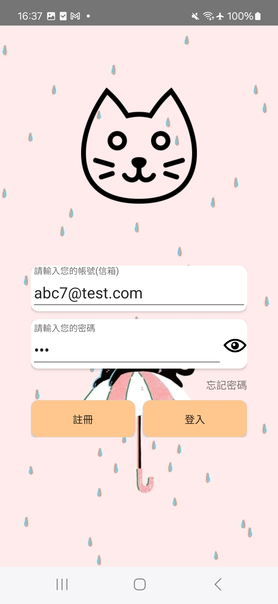 | 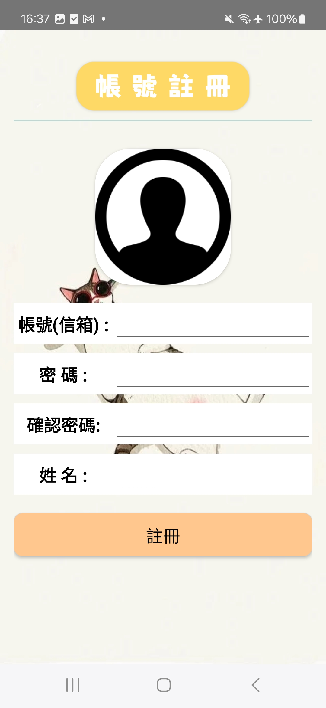|

| 左側抽屜 | 首頁 |
| :----: | :----: |
| 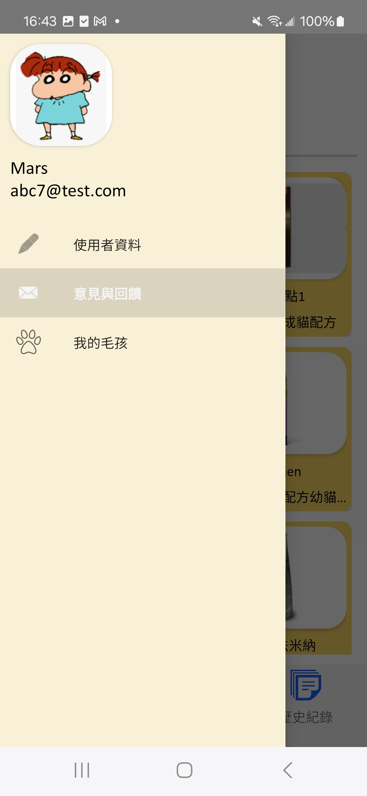 | 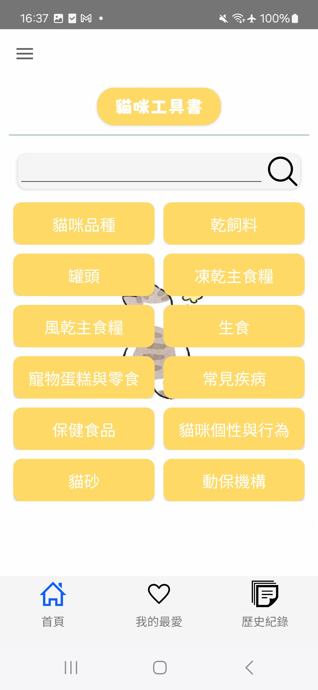|

| 我的最愛 | 歷史紀錄 |
| :----: | :----: |
| 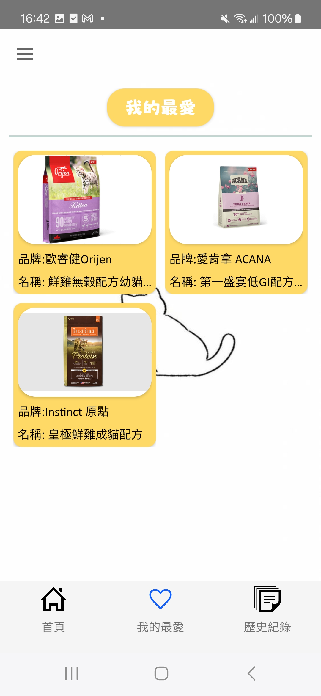 | 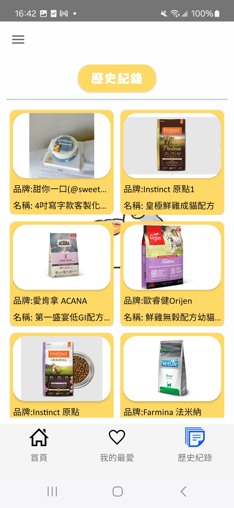|

| 全台動保APA | 動保APA內容 |
| :----: | :----: |
| 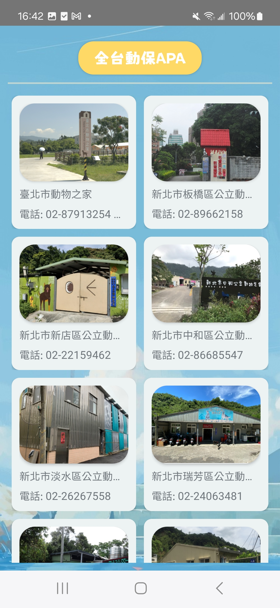 | 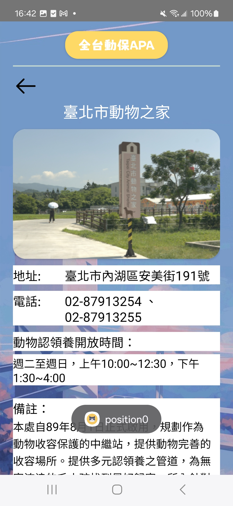|

| 動保APA內容2 | 傳染性疾病 |
| :----: | :----: |
| 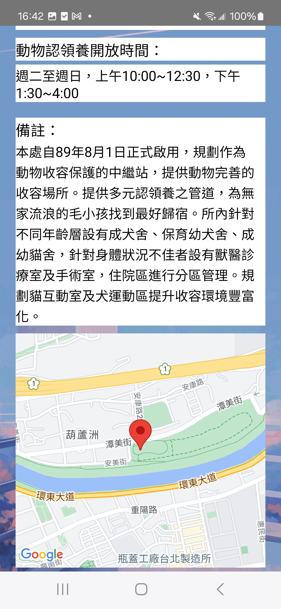 | 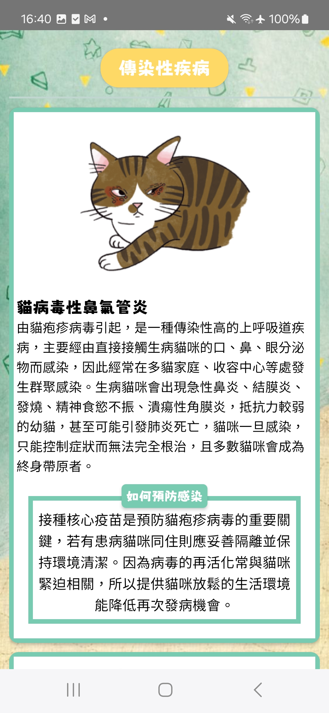|

| 嘔吐 | 常見疾病 |
| :----: | :----: |
| 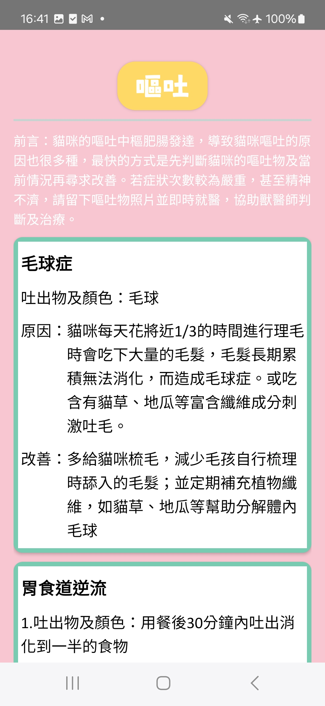 | 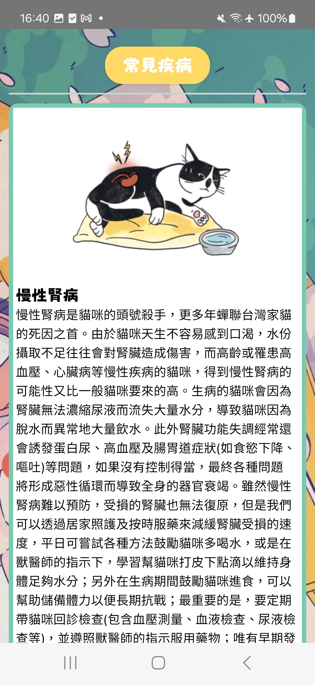|

| 常見疾病2 | 產品列表 |
| :----: | :----: |
| 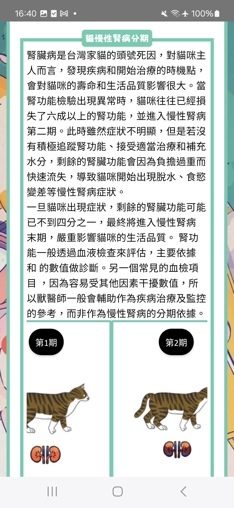 | 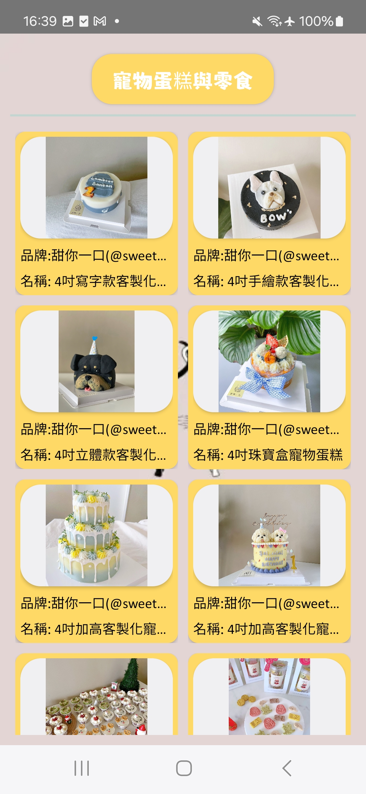|

| 產品內容 | 產品內容2 |
| :----: | :----: |
| 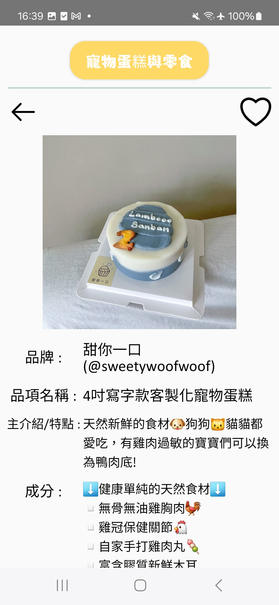 | 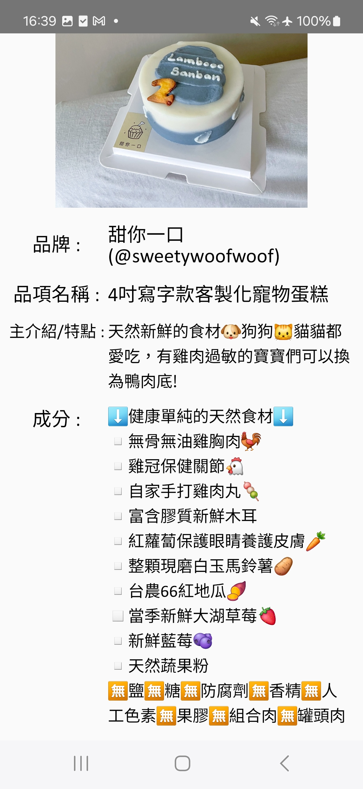|

| 貓砂 | 耳多 |
| :----: | :----: |
| 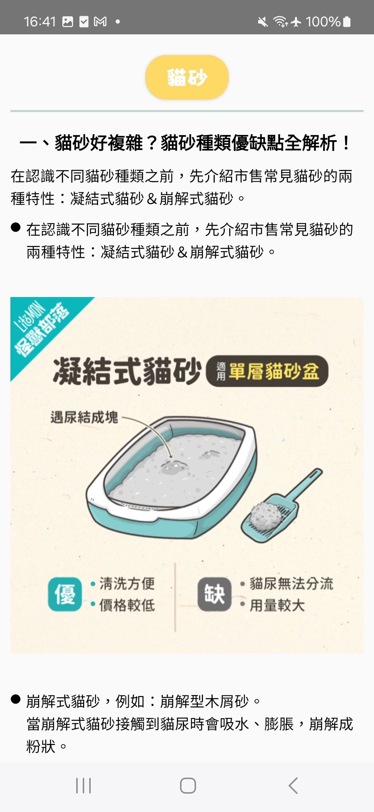 | 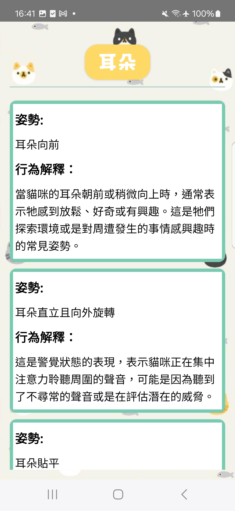|

| 花紋貓色 | 貓咪肉掌 |
| :----: | :----: |
| 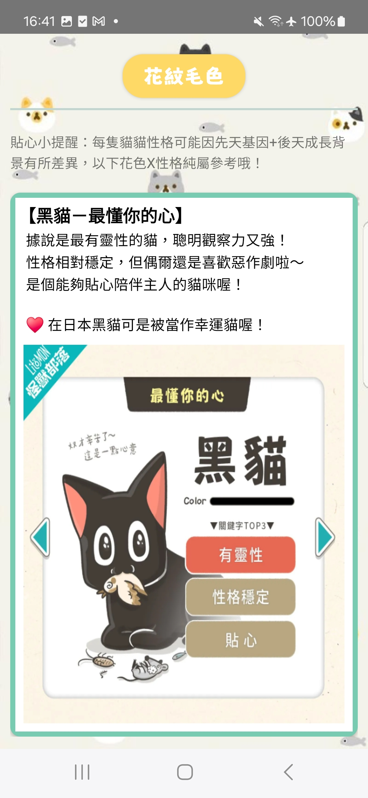 | 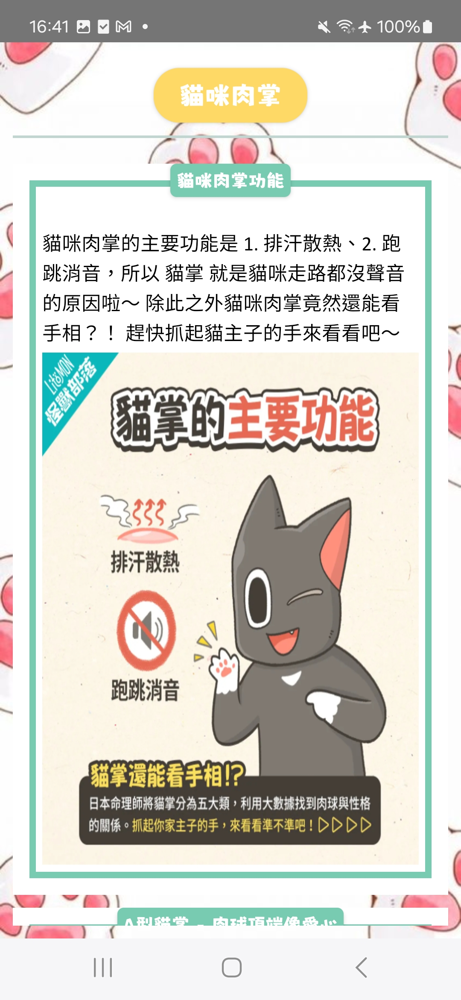|

| 體外寄生蟲 | 體內寄生蟲 |
| :----: | :----: |
| 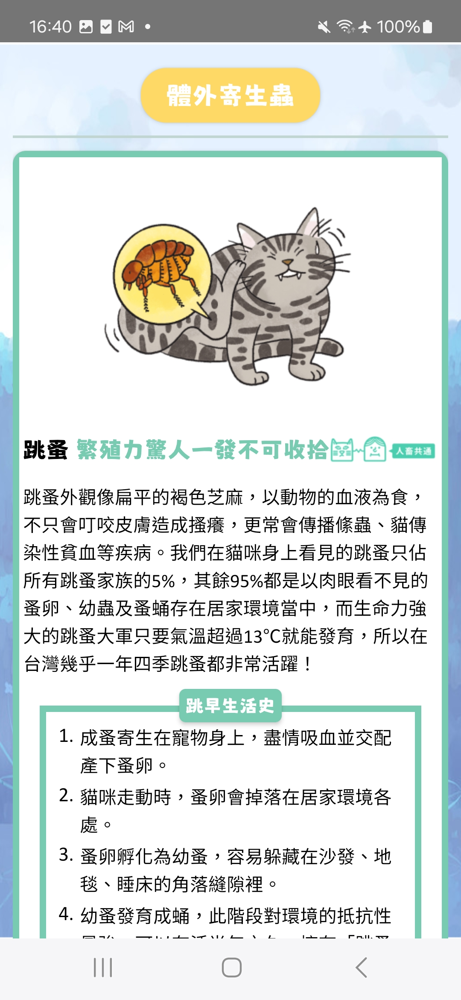 | 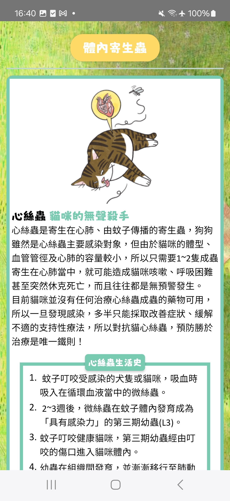|
